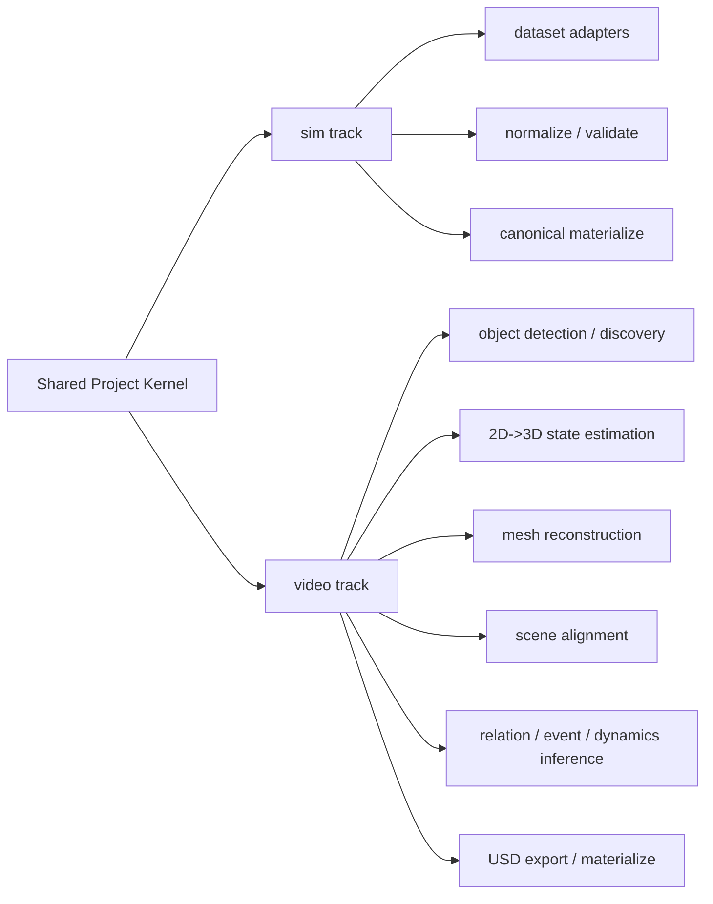

# algo.md

**项目名**：`观物` / `Guanwu`  
**文档类型**：Algorithm Component Spec  
**状态**：Implemented snapshot  
**范围**：当前仓库中已经落地的算法组件与其依赖关系

---

## 1. 文档目的

本文档只回答一个问题：

> 当前系统里，哪些模块是真正在做“感知 / 重建 / 推理 / 几何处理 / 导出决策”的算法组件，它们如何串起来？

这里的“算法组件”不等于“所有代码”。

- `projects/`、`storage/`、`catalog/`、CLI、配置加载，属于执行内核和数据工程基础设施；
- `sim` 主线里，大部分组件属于数据接入、规范化和校验；
- `video` 主线里，才集中包含真正的视觉、几何、物理和世界推理模块。

---

## 2. 总览

当前系统是一个双主线架构：

- `sim`：已有仿真 / 3D 数据集接入
- `video`：自然场景视频解析到 world state / USDC

共享的执行内核是 project 机制：

- stage 图
- artifact registry
- hash / invalidation
- status / manifest / lock

它本身不是算法模块，但决定了算法组件是如何被编排和复跑的。

---

## 3. 组件边界

### 3.1 非算法内核

以下模块不是算法组件，但会驱动算法组件执行：

- `src/guanwu/projects/`
- `src/guanwu/cli.py`
- `src/guanwu/storage/`
- `src/guanwu/core/config.py`
- `src/guanwu/video/project/context.py`
- `src/guanwu/video/project/artifacts.py`

### 3.2 算法密度分布

当前算法密度大致如下：

| 主线 | 算法密度 | 主要类型 |
|---|---:|---|
| `sim` | 低到中 | 解析、坐标/单位规范化、校验、导出 |
| `video` | 高 | 检测、开放词汇发现、2D-3D 提升、深度/位姿、重建、配准、关系/事件/物理推理、USD 导出 |

---

## 4. Shared Execution Model

### 4.1 Shared project kernel

模块：

- `src/guanwu/projects/artifacts.py`
- `src/guanwu/projects/context.py`
- `src/guanwu/projects/config.py`

能力：

- stage 状态记录
- artifact 输出登记
- stable hash 计算
- 下游失效传播
- resume / re-run / force

这层不关心具体算法，只负责：

- 把算法步骤组织成可复跑的 project
- 保留中间结果
- 让 `sim` 和 `video` 两条主线都能按相同 project 机制工作

---

## 5. `sim` 主线中的算法组件

### 5.1 组件总览

`sim` 主线的算法性主要体现在“统一解析与标准化”上，而不是视觉感知。

核心入口：

- `src/guanwu/sim/executor.py`
- `src/guanwu/adapters/base.py`

标准 stage：

- `inventory`
- `fetch`
- `parse`
- `normalize`
- `derived`
- `validate`
- `materialize`
- `catalog`
- `export`

### 5.2 数据集适配器族

模块：

- `src/guanwu/adapters/scannetpp.py`
- `src/guanwu/adapters/arkitscenes.py`
- `src/guanwu/adapters/objaverse_xl.py`
- `src/guanwu/adapters/partnet_mobility.py`
- `src/guanwu/adapters/maniskill3.py`
- `src/guanwu/adapters/robotwin2.py`
- `src/guanwu/adapters/robotwin2_replay.py`
- `src/guanwu/adapters/procthor_10k.py`

算法职责：

- 识别数据源目录结构
- 解析官方标注 / mesh / trajectory / state
- 映射到统一的 `ParseBundle`
- 规范化为 `NormalizeBundle`

### 5.3 坐标与单位规范化

模块：

- `src/guanwu/core/transforms.py`

能力：

- up-axis 统一到 `Z-up`
- 单位统一到 `meters`
- transform 合法性检查
- frame index 到 `timestamp_ns` 的派生

这是 `sim` 主线最重要的几何规范化算法。

### 5.4 规范化校验

模块：

- `src/guanwu/core/validation.py`

能力：

- scene / asset / episode / sensor / frame / instance / track 引用闭合检查
- timestamp 单调性检查
- transform 矩阵合法性检查
- articulation / license / provenance 的结构校验

### 5.5 导出算法

模块：

- `src/guanwu/exporters/usd.py`
- `src/guanwu/exporters/profiles.py`

能力：

- mesh / scene 到 USDC 的转换
- 按 profile 做不同强度的导出：
  - `mesh_preview`
  - `usd_full`
  - `ml_minimal`
  - `research_safe`

### 5.6 `sim` 主线结论

`sim` 的核心不是“推理”，而是：

- dataset-specific parser
- schema normalization
- coordinate normalization
- validation
- canonical export

它属于数据工程算法，不属于视觉重建算法。

---

## 6. `video` 主线中的算法组件

### 6.1 组件总览

核心入口：

- `src/guanwu/video/executor.py`
- `src/guanwu/video/project/executor.py`
- `src/guanwu/video/project/services.py`

`video` 当前标准 stage：

- `video.inspect`
- `frame.sample`
- `object.detect`
- `object.index`
- `object.attr`
- `geometry.lift`
- `mesh.reconstruct`
- `scene.compose`
- `physics.dynamics`
- `relation.infer`
- `event.infer`
- `world.compose`
- `world.align`
- `scene.export`
- `report.render`
- `materialize`
- `catalog`

其中真正的算法重心集中在：

- 检测 / 开放词汇发现
- 2D 到 3D 几何提升
- 背景与单体重建
- 物体-场景对齐
- 世界语义与物理推理
- USD / simulation export

---

## 7. `video` 算法组件分组

### 7.1 Zaiwu 服务接入层

这层定义“Guanwu 如何接入公司公共推理服务层”。

核心模块：

- `src/guanwu/video/clients/zaiwu.py`
- `src/guanwu/video/clients/mcp_backend.py`

当前接入职责：

- 通过 Zaiwu gateway 查询 worker 状态、自动拉起服务
- 对核心推理服务统一走 `/api/v1/jobs`
- 文件上传 / 下载仍通过各服务的 HTTP file endpoint 完成

当前对接的核心服务包括：

- `services.depth_anything3`
- `services.sam3`
- `services.grounding_dino_sam2`
- `services.seg2track_sam2`
- `services.sam3d`
- `services.wildgs_slam`
- `services.gotrack`

算法职责：

- 2D object detection / tracking
- 单物体 mesh reconstruction
- VLM 物理属性与类别发现

### 7.2 Zaiwu Job 结果适配层

模块：

- `src/guanwu/video/clients/mcp_backend.py`

主要组件：

- `MCPVideoObjectDetector`
- `MCPGroundedSAM2Adapter`
- `MCPSeg2TrackAdapter`
- `MCPSAM3DAdapter`
- `MCPWildGSAdapter`

算法职责：

- 规范化历史外部接口与当前 Guanwu 内部算法接口之间的差异
- 承接：
  - video parsing
  - grounded SAM2 / seg2track
  - SAM3D
  - WildGS-SLAM

### 7.3 开放词汇发现与检测调度

模块：

- `src/guanwu/video/features/detection/vlm_discovery.py`
- `src/guanwu/video/features/detection/keyframe_detector.py`

`VLMDiscoveryAgent`：

- 对第一帧做全量 object category discovery
- 对后续关键帧做 incremental discovery

`KeyframeDetector`：

- 用以下信号决定是否重新触发 VLM discovery：
  - 周期触发
  - 新目标进入
  - 目标消失
  - 检测置信度下降
  - 图像变化阈值

### 7.4 2D 到 3D 状态估计

核心模块：

- `src/guanwu/video/features/spatial/state_estimator.py`

这是当前 `video` 主线里最关键的几何 lifting 模块。

主要 provider：

- 相机位姿：
  - `synthetic`
  - `colmap`
  - `wildgs`
- 深度：
  - `depth_anything_v2`
  - `zaiwu_depth_anything3`
  - `wildgs metric depth`

约束：

- `camera_provider = wildgs` 时，`depth_provider` 也必须是 `wildgs`
- 旧配置里的 `heuristic` 会迁移为：
  - `wildgs` 相机链路下迁成 `wildgs`
  - 其他链路下迁成 `zaiwu_depth_anything3`
- provider 缺失、配置不匹配、依赖不可用时直接报错退出，不再做 heuristic depth fallback

算法职责：

- 读取相机内外参
- 从 detection / mask / bbox 中采样像素
- 查询深度
- 反投影到 3D
- 估计：
  - 3D centroid
  - 3D bbox
  - object trajectory
  - camera trajectory
- 支持 metric scale 与 scene-to-meter 转换

### 7.5 背景重建

模块：

- `src/guanwu/video/features/spatial/background_reconstruction.py`

算法职责：

- 调用 WildGS-SLAM 做背景重建
- 收集前景 bbox
- 对静态点云做前景 / 背景分离

这是自然视频里“静态场景几何”的来源之一。

### 7.6 物体与场景几何对齐

核心模块：

- `src/guanwu/video/features/spatial/object_scene_alignment.py`
- `src/guanwu/video/features/spatial/alignment_utils.py`
- `src/guanwu/video/features/spatial/robust_registration.py`
- `src/guanwu/video/features/spatial/visual_pose_tracking.py`

`ObjectSceneAlignmentRefiner` 的核心能力：

- depth ICP 对齐
- visual pose tracking 对齐
- 前景点云 fallback 对齐
- per-frame trajectory 修正
- mesh 尺度 / 朝向 / 锚点估计

其中包含两种重要路径：

- `gotrack_visual`：依赖 visual pose tracker
- `depth_icp`：依赖深度和点云

### 7.7 物理属性推理

模块：

- `src/guanwu/video/features/world_inference/object_attr.py`

`ObjectAttrAgent` 的职责：

- 对带 bbox / mask 的图像做 VLM 推理
- 输出对象级：
  - `is_movable`
  - `is_rigid_body`
  - `class_name`
  - `material_candidates`
  - `mass_range_kg`
  - `static_friction_range`
  - `dynamic_friction_range`
  - `restitution_range`
  - `confidence`

它会做：

- object-instance matching
- 非重叠实例分组
- 多批次 VLM 推理
- 缺失字段纠正与默认值回填

### 7.8 动力学估计

模块：

- `src/guanwu/video/features/world_inference/physics_dynamics.py`

`PhysicsDynamicsEstimator` 的职责：

- 从 3D trajectory 估计：
  - velocity
  - acceleration
  - angular velocity
  - motion class
- 基于先验质量范围和观测加速度做质量校准

当前算法特点：

- 简单平滑
- 速度 / 加速度有限差分
- 规则式 motion class 分类
- 轻量质量校准

### 7.9 关系推理

模块：

- `src/guanwu/video/features/world_inference/relation_engine.py`

`RelationEngine` 当前是 rule-based。

它推理：

- object-object：
  - `on`
  - `next_to`
  - `contact_with`
- object-background：
  - `on_floor`
  - `against_wall`

它还会：

- 从 WildGS static map 点云估计 floor plane 与 wall boundary
- 抑制背景类对象参与某些关系推断

### 7.10 事件推理

模块：

- `src/guanwu/video/features/world_inference/event_engine.py`

`EventEngine` 当前也是 rule-based。

它推理：

- `appeared`
- `disappeared`
- `collision`
- `picked_up`
- `placed_on`

输入主要来自：

- object lifecycle
- relation start / end

### 7.11 Simulation / USD 导出

核心模块：

- `src/guanwu/video/features/simulation/pit2isaac_exporter.py`
- `src/guanwu/video/features/simulation/usd_coordinate_convention.py`
- `src/guanwu/video/features/simulation/runner.py`
- `src/guanwu/video/infra/isaac_sync.py`

`PIT2IsaacExporter` 职责：

- 根据 object / relation / pit snapshot 组装 export bundle
- 建立 asset plan
- 整理 physics prior
- 选择 collision strategy
- 输出 USD / USDZ / fallback JSON

这层本质上是“仿真表示编译器”。

### 7.12 最终 materialize

模块：

- `src/guanwu/video/materialize.py`

它不是“推理算法”，但负责把算法产物转换成观物 canonical record：

- 1 个 `SceneRecord`
- 1 个 `EpisodeRecord`
- 1 个 camera `SensorRecord`
- N 个 `FrameRecord`
- N 个 `InstanceRecord`
- N 条 `TrackStateRecord`
- 0..N 个 `AssetRecord`

几何等级规则：

- 有 proxy mesh：`G3_PROXY_MESH`
- 只有点级观测 / 轨迹：`G2_POINT_OBS`

---

## 8. `video` stage 到算法组件映射

| Stage | 主要算法组件 | 主要输出 |
|---|---|---|
| `video.inspect` | `VideoFrameReader.metadata` | `video_metadata.json` |
| `frame.sample` | 帧采样 / 首帧提取 | `frame_index.json`, `first_frame.jpg` |
| `object.detect` | Zaiwu detector / VLM discovery / keyframe detector | 每帧 `detections.json` |
| `object.index` | object id 聚合 / 跨帧索引 | `objects.json`, `object_frames.json` |
| `object.attr` | `ObjectAttrAgent` | `object_attrs.json` |
| `geometry.lift` | `StateEstimationAgent`, WildGS-SLAM 接入 | `camera_trajectory`, `object_trajectories`, `summary.json` |
| `mesh.reconstruct` | Zaiwu SAM3D / backend mesh materialization | `sam3d_meshes.json` |
| `scene.compose` | `ObjectSceneAlignmentRefiner`, ICP / visual pose | `corrected_trajectories.json`, `scene_manifest.json` |
| `physics.dynamics` | `PhysicsDynamicsEstimator` | `physics_dynamics.json` |
| `relation.infer` | `RelationEngine` | `relations.json` |
| `event.infer` | `EventEngine` | `events.json` |
| `world.compose` | world aggregation | `world_state.raw.json`, `pit_snapshot.raw.json` |
| `world.align` | world state alignment / sqlite persistence | `world_state.aligned.json`, `pit_snapshot.aligned.json` |
| `scene.export` | `PIT2IsaacExporter` 或直接 USDC export | `scene.usdc`, `conversion_report.json` |
| `report.render` | HTML summary generation | `index.html`, `summary.json` |
| `materialize` | canonical materialize | `materialize_report.json` |
| `catalog` | catalog build | `catalog_stats.json` |

---

## 9. 运行模式矩阵

当前 `video` 算法链支持两类 provider mode：

| Mode | 检测 | 重建 | VLM | 适用场景 |
|---|---|---|---|---|
| `mock` | 本地占位逻辑 | 本地占位逻辑 | 规则 / 默认值 | 测试、CI |
| `zaiwu` | Zaiwu gateway + detector services | Zaiwu SAM3D / WildGS | 本地 VLM + Zaiwu sidecar | 外部推理基础设施 |

说明：

- `mock` 主要用于测试 project 生命周期，不代表真实效果；
- `zaiwu` 是当前正式的外部推理基础设施接入层；
- `zaiwu` 模式下，核心检测 / 重建 / SLAM / pose refinement 已统一通过 jobs handler 调用

---

## 10. 关键输入输出依赖

### 10.1 `video` 主线核心依赖

- `object.detect` 依赖：
  - video frames
  - detector backend
  - VLM discovery
- `geometry.lift` 依赖：
  - detections
  - camera pose provider
  - depth provider
- `mesh.reconstruct` 依赖：
  - geometry summary
  - object attrs
  - SAM3D backend
- `scene.compose` 依赖：
  - reconstructed meshes
  - depth / WildGS outputs
  - alignment backend
- `relation.infer` / `event.infer` / `physics.dynamics` 依赖：
  - 3D objects / trajectories
  - object attrs
  - background geometry
- `scene.export` 依赖：
  - corrected trajectories
  - aligned world state
  - mesh / asset plan

### 10.2 `sim` 主线核心依赖

- `parse` 依赖 adapter 的 dataset parser
- `normalize` 依赖 transform / schema mapping
- `validate` 依赖 canonical schema checks
- `export` 依赖 canonical store + exporter profile

---

## 11. 当前实现状态总结

### 11.1 已实现

- `sim` 与 `video` 双主线都基于 project 机制运行
- `video/project` 已迁入 `symphys-world` 的完整 project runtime
- `video` 已切换到 Zaiwu gateway + service 体系
- `video` 生命周期、canonical materialize、catalog build 已接通

### 11.2 当前算法形态

- 检测 / discovery / mesh reconstruction 支持多后端
- relation / event 目前是 rule-based
- dynamics 目前是轻量 kinematic estimator
- sim 主线主要仍是 ETL + normalize，不是学习式推理

### 11.3 当前局限

- `mock` 路径仍广泛用于测试
- 高质量结果依赖外部模型、Zaiwu worker、WildGS、SAM3D 等运行环境
- 关系与事件尚未演进为学习式 world model
- `video` 的 `materialize` 当前只把核心 scene/episode/frame/instance/track/asset 入 canonical

---

## 12. 建议阅读顺序

如果要快速理解当前算法系统，推荐按下面顺序读代码：

1. `src/guanwu/video/project/artifacts.py`
2. `src/guanwu/video/project/executor.py`
3. `src/guanwu/video/project/services.py`
4. `src/guanwu/video/features/spatial/state_estimator.py`
5. `src/guanwu/video/features/spatial/object_scene_alignment.py`
6. `src/guanwu/video/features/world_inference/object_attr.py`
7. `src/guanwu/video/features/world_inference/physics_dynamics.py`
8. `src/guanwu/video/features/world_inference/relation_engine.py`
9. `src/guanwu/video/features/world_inference/event_engine.py`
10. `src/guanwu/video/features/simulation/pit2isaac_exporter.py`
