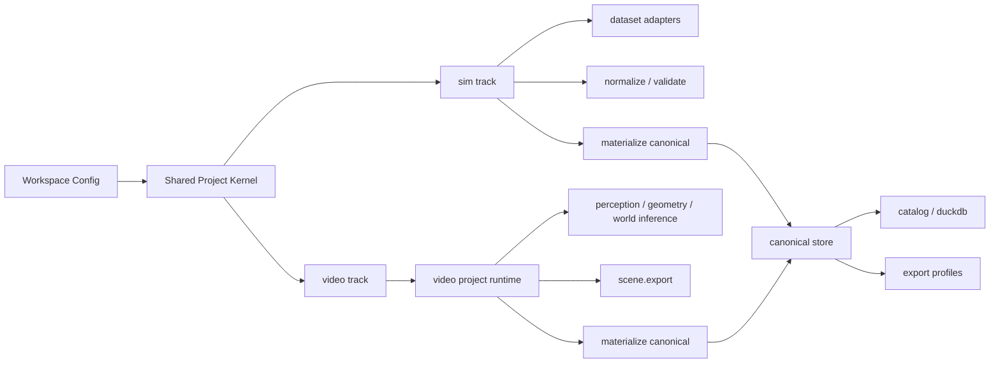

# overall.md

**项目名**：`观物` / `Guanwu`  
**文档类型**：Overall Engineering Spec  
**状态**：Implemented snapshot  
**语言**：中文为主，保留必要英文术语  
**目标读者**：代码维护者、数据工程师、3D/仿真工程师、研究工程师

---

## 1. 背景与目标

`观物` 现在不再被定义为一个“单一数据接入脚本集合”，而是一个**双主线、project 化、可追溯的数据工厂**。

系统的顶层能力分成两条一等公民主线：

- `sim`：接入已有仿真 / 3D / 结构化数据集
- `video`：把自然场景视频解析为 world state 与 `USDC`

两条主线都采用统一的 project 机制：

- 每次处理都对应一个 project
- 每个 project 按 stage 运行
- 每个 stage 都有显式 artifact
- 支持状态追踪、增量失效、重跑、resume、inspect

系统的最终目标不是训练，而是构建一个：

- mesh-first
- geometry-level aware
- provenance-complete
- 可查询
- 可重复构建

的 canonical 数据仓库。

---

## 2. 顶层原则

### 2.1 双主线能力分离

顶层必须显式区分：

- “已有数据集接入”
- “自然视频解析生成”

这件事已经体现在：

- CLI 入口
- 仓库组织
- project 根目录布局
- canonical dataset source type

### 2.2 Shared kernel，domain-specific execution

共享内核只负责：

- project config
- manifest
- stage status
- artifact registry
- hash / invalidation
- lock / resume

领域逻辑分别放在：

- `src/guanwu/sim/`
- `src/guanwu/video/`

### 2.3 Mesh-first，但不伪造精度

系统统一使用 geometry level 描述几何可信度：

- `G0_NONE`
- `G1_BBOX`
- `G2_POINT_OBS`
- `G3_PROXY_MESH`
- `G4_EXACT_MESH`
- `G5_ARTICULATED_MESH`
- `G6_DEFORMABLE_MESH`

规则：

- 不允许把没有真值 mesh 的输入静默升级成 `G4_EXACT_MESH`
- `video` 生成出的 scene / asset 默认最高只能到 `G3_PROXY_MESH`
- 真实数据集原生 mesh 可达到 `G4` 或 `G5`

### 2.4 Raw 与 canonical 分离

- `raw/` 保留原始输入
- `projects/` 保留运行时真相源和中间产物
- `canonical/` 是发布层真相源
- `catalog/` 是查询层

project 输出默认不会直接充当 canonical 真相源。

### 2.5 License 与 provenance 是一等元数据

所有 canonical 产物都应可追溯：

- 来源
- adapter / pipeline 版本
- transform log
- 许可约束

---

## 3. 系统总览



---

## 4. 代码仓库组织

当前仓库按“共享内核 + 领域分层”组织：

```text
src/guanwu/
  projects/           # shared project kernel
  core/               # config, transforms, validation, remote helpers
  schemas/            # canonical models
  storage/            # canonical store + catalog
  exporters/          # USD / profile exporters
  sim/                # simulation / dataset ingest track
  video/              # natural video parsing track
  adapters/           # compatibility adapter namespace
  registry/           # compatibility registry namespace
```

### 4.1 Shared kernel

模块：

- `src/guanwu/projects/artifacts.py`
- `src/guanwu/projects/config.py`
- `src/guanwu/projects/context.py`

职责：

- stage 状态
- artifact 记录
- manifest
- lock file
- stable hash
- invalidation

### 4.2 `sim` 领域层

模块：

- `src/guanwu/sim/executor.py`
- `src/guanwu/sim/materialize.py`
- `src/guanwu/sim/registry/manager.py`
- `src/guanwu/sim/adapters/`

### 4.3 `video` 领域层

模块：

- `src/guanwu/video/executor.py`
- `src/guanwu/video/project/`
- `src/guanwu/video/features/`
- `src/guanwu/video/clients/`
- `src/guanwu/video/materialize.py`

说明：

- `video/project/` 是迁入后的 `symphys-world` project runtime 主体
- `video/executor.py` 是 Guanwu 的包装层
- `video/clients/zaiwu.py` 负责对接 Zaiwu gateway、worker 生命周期和 job API
- `video/clients/mcp_backend.py` 主要保留历史兼容适配与少量辅助工具

---

## 5. Workspace 布局

当前 workspace 结构推荐为：

```text
workspace/
  raw/
  staging/
  canonical/
    datasets/
      <dataset_id>/
        dataset.json
        scenes/
        assets/
        episodes/
  exports/
  catalog/
    catalog.duckdb
  projects/
    sim/
      <dataset_id>/
        <project_id>/
    video/
      <project_id>/
```

### 5.1 `sim` project 布局

```text
projects/sim/<dataset_id>/<project_id>/
  project.toml
  state/
    manifest.json
    stage_status.json
    artifacts.json
  outputs/
    inventory/
    fetch/
    parse/
    normalize/
    derived/
    validate/
    materialize/
    catalog/
    export/
  cache/
  logs/
```

### 5.2 `video` project 布局

```text
projects/video/<project_id>/
  project.toml
  input/
    video.mp4
  state/
    manifest.json
    stage_status.json
    artifacts.json
    latest_world_state.json
    world.db
  outputs/
    01_video_inspect/
    02_frame_sample/
    ...
  cache/
  logs/
```

说明：

- `sim` 使用 shared project context，`outputs/<stage>/`
- `video` 使用迁入的 SPWM project context，输出目录是编号前缀形式

---

## 6. 配置模型

核心配置定义在：

- `src/guanwu/core/config.py`

### 6.1 WorkspaceConfig

核心字段：

- `workspace_root`
- `storage`
- `runtime`
- `video_pipeline`
- `policies`
- `datasets`

### 6.2 StorageConfig

关键路径：

- `raw_root`
- `staging_root`
- `canonical_root`
- `export_root`
- `catalog_path`
- `project_root`

### 6.3 VideoPipelineConfig

关键字段：

- `provider_mode`
- `camera_provider`
- `export_profile`
- `default_dataset_id`

---

## 7. Shared Project 机制

两条主线都必须使用 project 机制，但实现方式略不同：

- `sim`：直接使用 `src/guanwu/projects/*`
- `video`：使用迁入后的 `src/guanwu/video/project/*`

共同特征：

- `project.toml`
- `manifest.json`
- `stage_status.json`
- `artifacts.json`
- stable hash
- force rerun
- downstream invalidation
- cached stage reuse

### 7.1 项目运行原则

- 一个 project 对应一次明确的数据处理任务
- 每个 stage 都要把关键中间结果落盘
- 每个 artifact 都必须可 inspect
- 每次 force 上游 stage 时，要正确清空下游状态

---

## 8. `sim` 主线设计

### 8.1 定义

`sim` 主线负责把已有数据集接入 canonical 仓库。

它面向的输入包括：

- 仿真场景
- 对象资产
- 轨迹与状态日志
- RGB-D / LiDAR / 多传感器数据集
- 结构化 mesh / articulation 数据集

### 8.2 核心执行入口

- `src/guanwu/sim/executor.py`

### 8.3 stage 图

标准 stage：

- `inventory`
- `fetch`
- `parse`
- `normalize`
- `derived`
- `validate`
- `materialize`
- `catalog`
- `export`

### 8.4 adapter 契约

基础接口在：

- `src/guanwu/adapters/base.py`

必须实现：

- `inventory`
- `fetch`
- `parse_raw`
- `normalize`
- `validate`
- `emit`

### 8.5 `sim` 主线职责边界

它主要做：

- 数据源扫描
- 原始文件接入
- dataset-specific 结构解析
- canonical schema 规范化
- 校验
- canonical materialize
- catalog build
- export profile

它默认不做学习式推理。

---

## 9. `video` 主线设计

### 9.1 定义

`video` 主线负责把单个自然场景视频解析为：

- object detections / tracks
- 3D object trajectories
- proxy meshes
- scene-level USDC
- canonical scene / episode / sensor / frame / instance / track / asset 记录

### 9.2 核心执行入口

- `src/guanwu/video/executor.py`
- `src/guanwu/video/project/executor.py`

### 9.3 执行模型

`video` 采用迁入后的 `symphys-world` project runtime。

当前 stage 图：

- `video.inspect`
- `frame.sample`
- `object.detect`
- `object.index`
- `object.attr`
- `geometry.lift`
- `mesh.reconstruct`
- `scene.compose`
- `physics.dynamics`
- `relation.infer`
- `event.infer`
- `world.compose`
- `world.align`
- `scene.export`
- `report.render`
- `materialize`
- `catalog`

### 9.4 provider mode

当前支持两种 provider mode：

- `mock`
- `zaiwu`

说明：

- `mock` 主要用于测试
- `zaiwu` 走外部 Zaiwu gateway
- `zaiwu` 模式下，Guanwu 通过 gateway 完成 worker 发现 / 启动，并统一通过 jobs handler 调用核心推理能力

### 9.5 关键算法子系统

集中在：

- `video/clients/zaiwu.py`
- `video/clients/mcp_backend.py`
- `video/features/detection/`
- `video/features/spatial/`
- `video/features/world_inference/`
- `video/features/simulation/`

这些内容的详细说明见：

- [algo.md](algo.md)

### 9.6 `video` 与 canonical 的关系

`video` 的 project 运行时先生成 project 内产物：

- detections
- trajectories
- world state
- `scene.usdc`

然后再通过：

- `src/guanwu/video/materialize.py`

把这些产物 materialize 进 canonical store。

---

## 10. Canonical 数据模型

核心 schema 位于：

- `src/guanwu/schemas/records.py`
- `src/guanwu/schemas/bundles.py`
- `src/guanwu/schemas/enums.py`

### 10.1 一级记录类型

当前 canonical 的核心记录包括：

- `DatasetRecord`
- `SceneRecord`
- `AssetRecord`
- `EpisodeRecord`
- `SensorRecord`
- `FrameRecord`
- `InstanceRecord`
- `TrackStateRecord`
- `ArticulationStateRecord`
- `LicenseRecord`
- `ProvenanceRecord`

### 10.2 `NormalizeBundle`

当前 `NormalizeBundle` 已显式支持：

- `episodes`

这意味着 canonical 不再只是 dataset / scene / asset 三层，而是显式支持 episode 层。

### 10.3 `video` 的 canonical 规则

对于 `natural_video`：

- 一条视频默认映射为 1 个 scene
- 同时映射为 1 个 episode
- 生成 1 个 camera sensor
- 每帧变成 frame record
- 每个对象变成 instance record
- 每条时间轨迹变成 track state
- 成功重建 mesh 的对象才会生成 asset record

---

## 11. Canonical Store 与 Catalog

### 11.1 CanonicalStore

核心实现：

- `src/guanwu/storage/canonical_store.py`

当前 canonical store 已支持：

- `dataset.json`
- `scene_meta.json`
- `asset_meta.json`
- `episode_meta.json`
- `sensors.parquet` / scene sensors
- `frames.parquet` / scene frames
- `sensor_frames.parquet` / episode sensor frames
- `instances.parquet`
- `tracks.parquet`
- `states.parquet` / episode states
- licenses
- provenance

### 11.2 Catalog

核心实现：

- `src/guanwu/storage/catalog.py`

当前 catalog 会扫描：

- `datasets`
- `scenes`
- `assets`
- `episodes`
- `sensors`
- `frames`
- `instances`
- `track_states`
- `articulation_states`
- `licenses`
- `provenance`

查询层使用 DuckDB。

---

## 12. 几何等级与 source type 规则

### 12.1 GeometryLevel

定义在：

- `src/guanwu/schemas/enums.py`

取值：

- `G0_NONE`
- `G1_BBOX`
- `G2_POINT_OBS`
- `G3_PROXY_MESH`
- `G4_EXACT_MESH`
- `G5_ARTICULATED_MESH`
- `G6_DEFORMABLE_MESH`

### 12.2 `video` 默认规则

`natural_video` 当前规则：

- 有 proxy mesh 时，scene / asset 可达 `G3_PROXY_MESH`
- 无 mesh 但有 3D 轨迹与点级观测时，为 `G2_POINT_OBS`
- 不允许把 `video` 结果标成 `G4_EXACT_MESH`

### 12.3 SourceType

`sim` 数据集通常来自：

- `official_download`
- `sdk`
- `local_folder`
- `manifest`

`video` 默认对应：

- `generator`

---

## 13. CLI 设计

主 CLI 在：

- `src/guanwu/cli.py`

### 13.1 新的主入口

当前推荐入口：

- `guanwu sim ...`
- `guanwu video ...`

### 13.2 `sim` 命令

主要命令：

- `guanwu sim registry list`
- `guanwu sim registry show <dataset_id>`
- `guanwu sim project init --dataset ...`
- `guanwu sim project status <project>`
- `guanwu sim project inspect <project>`
- `guanwu sim step <stage> <project>`
- `guanwu sim run <project> --from inventory --to catalog`

### 13.3 `video` 命令

主要命令：

- `guanwu video project init --video ...`
- `guanwu video project status <project>`
- `guanwu video project inspect <project>`
- `guanwu video step <stage> <project>`
- `guanwu video run <project> --from video.inspect --to scene.export`
- `guanwu video materialize <project>`

### 13.4 兼容命令

旧入口仍保留一个兼容周期：

- `guanwu inventory`
- `guanwu fetch`
- `guanwu ingest`
- `guanwu validate`
- `guanwu export`
- `guanwu pipeline run`
- `guanwu registry list/show`

这些命令内部会自动创建或复用 `sim` project。

---

## 14. 校验与导出

### 14.1 校验

统一校验引擎：

- `src/guanwu/core/validation.py`

当前重点检查：

- scene / episode / sensor / frame / instance / track 引用闭合
- transform 合法性
- timestamp 单调性
- asset / articulation / license / provenance 完整性

### 14.2 导出

导出系统在：

- `src/guanwu/exporters/profiles.py`
- `src/guanwu/exporters/usd.py`

profile：

- `mesh_preview`
- `usd_full`
- `ml_minimal`
- `research_safe`

---

## 15. 测试与验收

当前测试覆盖包括：

- shared config / schema / transform / taxonomy
- adapter contract
- CLI 兼容路径
- `sim` project 生命周期
- `video` project 生命周期
- canonical / catalog 回归
- downstream invalidation
- 无 mesh 的 `video` materialize 降级场景

核心新增测试在：

- `tests/test_projects.py`

当前基线：

- 全量测试通过

---

## 16. 当前限制

### 16.1 `sim`

- 仍以 adapter + ETL 为主
- `derived` stage 现在还是轻量占位报告

### 16.2 `video`

- `mock` 路径仍然存在，用于测试和最小可运行性
- 真实效果依赖外部模型与推理后端
- relation / event 仍是 rule-based
- dynamics 仍是轻量 kinematic estimator
- `materialize` 当前只入 canonical 的核心记录，不把所有 project 产物都扩展成一级 catalog 表

### 16.3 Zaiwu 运行时依赖

`video` 真实推理效果依赖外部 Zaiwu 服务编排状态。

影响：

- gateway 未配置或目标 worker 未启动时，`zaiwu` 模式会在服务发现或 job 轮询阶段失败
- 不影响 `mock` 路径以及当前 `sim` / `video` 主线测试

---

## 17. 后续演进方向

建议的下一步包括：

- 把 `video` 的更多 project 产物纳入更细粒度 catalog
- 为 `relation` / `event` 引入学习式 world model
- 把 `sim` 的 `derived` stage 扩展成真正的几何派生产品生成
- 增加批量视频 manifest project
- 增加更明确的 project schema versioning
- 把 `video` provider 和 `sim` adapter 的资源消耗描述纳入 registry

---

## 18. 阅读顺序

推荐从以下文件开始理解当前系统：

1. `src/guanwu/cli.py`
2. `src/guanwu/projects/*`
3. `src/guanwu/sim/executor.py`
4. `src/guanwu/video/executor.py`
5. `src/guanwu/video/project/executor.py`
6. `src/guanwu/storage/canonical_store.py`
7. `src/guanwu/storage/catalog.py`
8. `specs/algo.md`
